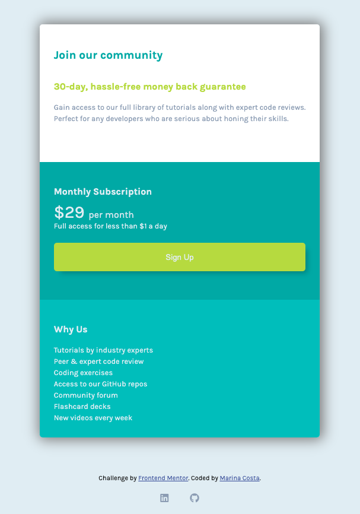

<h1 align="center">Frontend Mentor - Single Price Grid Component</h1>

- I created this landing page based on the [Frontend Mentor - Fylo Single Price Grid Component](https://www.frontendmentor.io/challenges/single-price-grid-component-5ce41129d0ff452fec5abbbc) design.

## Overview

## Goals

- The goal of this project was to practice CSS grid by creating a responsive website following the design provided by Frontend Mentor.
- I was provided the design, including texts, images, icons and a style guide and I had to create that design in HTML and CSS. 

## How to use it

- Download the files and open `index.html` on the browser.

## References and resources

* [Frontend Mentor](https://www.frontendmentor.io/challenges/single-price-grid-component-5ce41129d0ff452fec5abbbc)
* [MDN Documentation](https://developer.mozilla.org/en-US/)
* [CSS Tricks](https://css-tricks.com/snippets/css/complete-guide-grid/)
* [Box shadow generator](https://www.cssmatic.com/box-shadow)